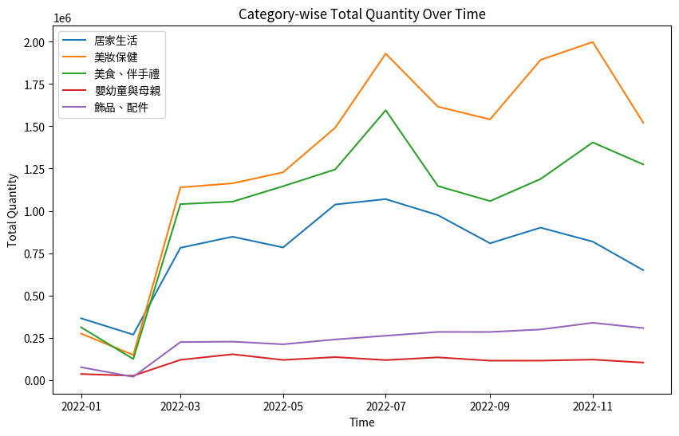
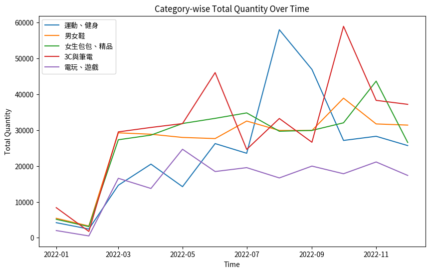

# E-commerce Text Mining & Sales Trend Analysis

A Python project that analyzes e-commerce product data and customer comments using text mining, sentiment analysis, and time-based sales aggregation.

## Overview

This project was originally developed as a university text-mining project. The public version has been cleaned for portfolio use: Colab-specific paths and outputs were removed, the data-loading process was made configurable, and original user identifiers/raw customer data are not included.

## What I did

- Cleaned customer-comment data by removing promotional/advertising content
- Used **Jieba** POS tagging to extract noun candidates from product names
- Matched customer comments with product-related terms
- Used **SnowNLP** to calculate sentiment scores and classify comments
- Combined monthly product datasets and aggregated sales quantity by category and month
- Visualized category-level sales trends with **Matplotlib**

## Tech Stack

- Python
- Pandas / NumPy
- Jieba
- SnowNLP
- Matplotlib
- Jupyter Notebook

## Project Structure

```text
ecommerce-text-mining-analysis/
├── README.md
├── text_mining_analysis.ipynb
├── requirements.txt
├── data/
│   └── README.md
└── images/
    ├── category_trends_1.png
    ├── category_trends_2.png
    └── category_trends_3.png
```

## Analysis Workflow

```text
Raw product/comment data
        ↓
Comment preprocessing
        ↓
Chinese word segmentation & noun extraction
        ↓
Product-related comment matching
        ↓
Sentiment analysis
        ↓
Monthly sales aggregation
        ↓
Category trend visualization
```

## Example Results

### Category sales trends

The analysis compares monthly total quantities across selected product categories.





## How to Run

1. Install the dependencies:

```bash
pip install -r requirements.txt
```

2. Place the original datasets locally according to `data/README.md`.

3. Open `text_mining_analysis.ipynb` with Jupyter Notebook or VS Code.

4. Run the notebook from top to bottom.

## Data & Privacy Note

The original datasets are not published in this repository. The public version also omits the specific source user IDs used in the original preprocessing step.

## Project Context

This project was completed as part of a university text-mining course project. The repository is a portfolio-oriented cleanup of the original notebook; the analysis approach and main techniques are based on the original project.
